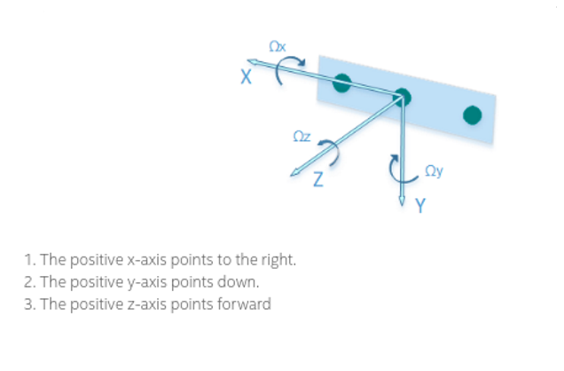

# Inclination package

This package includes 2 launch files related to distinct aplications.

## Identifying irregularities in the groud

The code identify_irregularity.py as 2 stages:

1. calibration stage where we try to find the average inclination of the ground;
2. Assuming that the distribution of inclination values trough time is **Normal**, continued measurements of the inclination of the ground are made. We look for outliners to identify a irregularity (2*standart deviation) .

This application can be launched using:

`roslaunch inclination irregularity_identifier.launch`

## Identify inclination of the camera

We use the IMU data from the realsense camera to get the inclination around each axis in degrees. As the image shows:

